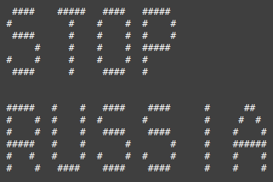

# Hey 👋

- 🌱 I’m currently learning NodeJS
- 🔭 I’m currently working on smth curious
- 📫 How to reach me: **d.s.kolisnyk@i.ua**

## My skills

## Popular repositories

## Some statistics

<!--
- 👯 I’m looking to collaborate on ...
- 🤔 I’m looking for help with ...
- 💬 Ask me about ...
- 😄 Pronouns: ...
- ⚡ Fun fact: ...
-->
